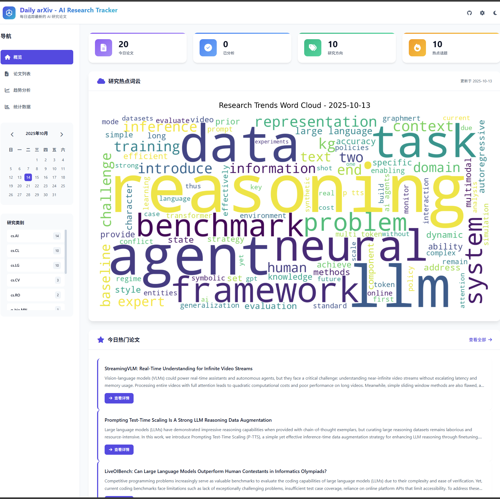
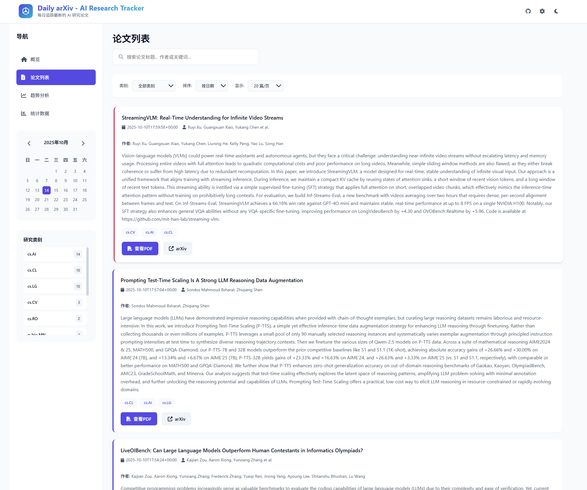
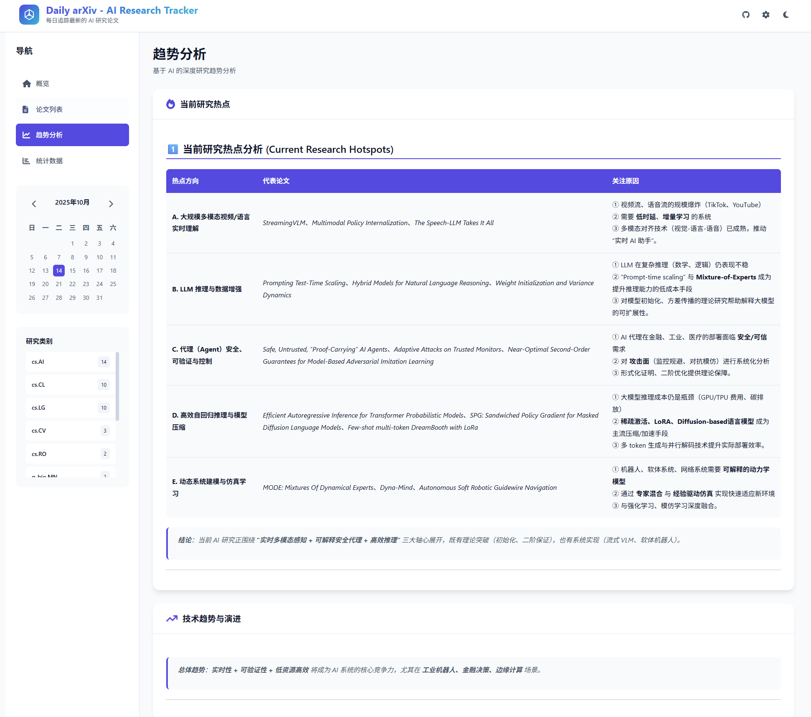

# Auto-Research - AI Research Tracker 📚🤖

[English](README.md) | **中文文档**

每日自动追踪 arXiv 上最新的 AI 研究论文，使用 Copilot CLI + MinerU 基于全文生成双语总结，自动同步到 Zotero，并在每周四生成研究综述与 introduction-ready 的研究 idea。

## ✨ 功能特性

### 核心功能

- 🔍 **智能爬取**: 每天自动从 arXiv 获取指定领域的最新论文
  - 支持多研究领域（cs.AI, cs.LG, cs.CV等）
  - 关键词过滤
  - TF-IDF 智能筛选
  - 自动过滤历史已抓取论文；若当天没有新论文，则跳过后续步骤

- 🤖 **代理驱动的全文总结**: 使用 Copilot CLI + MinerU MCP 先读 PDF 全文再总结
  - 每篇论文保存全文 Markdown
  - 生成中英双语结构化总结
  - 保存可直接写入 Zotero 的中英双语笔记正文

- 📊 **趋势分析**: 深度分析研究热点和技术趋势
  - TF-IDF 关键词提取
  - LDA 主题建模
  - 词云可视化
  - Copilot 驱动的趋势叙事分析（研究热点、技术趋势、未来方向）

- 🌐 **Web 界面**: 现代化响应式 Web 界面
  - Bootstrap 5 设计
  - 实时数据展示
  - 论文详情查看
  - 分页和筛选

- ⏰ **定时调度**: 支持多种调度方式
  - APScheduler 调度器（推荐）
  - Linux Cron 任务
  - Systemd 系统服务

- 📚 **Zotero 自动同步**: 支持使用 Copilot CLI + Zotero MCP 每日上传论文
  - 读取 `data/papers/latest.json` 与 `data/summaries/latest.json`
  - 将英文和中文全文总结笔记追加到 Zotero 条目
  - 将每日报告写入 `daily analysis` 集合

- 💡 **每周 idea 生成**: 支持每周四自动生成研究综述与选题构想
  - 汇总本周论文
  - 结合整个 Zotero 仓库中的已有文章寻找机会点
  - 将最终结果写入 `idea` 集合并保存到本地

- 📧 **邮件通知**: 任务执行状态邮件通知
  - 美观的 HTML 邮件模板
  - 成功/失败分别通知
  - 详细统计信息

## 📸 界面预览



## 🚀 快速开始

### 前置要求

- Python 3.12+
- uv
- GitHub Copilot CLI（已登录）
- 已配置好的 `mineru` 与 `zotero` MCP 服务器
- 旧版 LLM API Key 仅在你仍手动使用旧 provider 模块时可选

### 1. 克隆项目

```bash
git clone https://github.com/ycwfs/Auto-Research
cd auto-research
```

### 2. 安装 uv 并创建虚拟环境

```bash
# 若未安装 uv，先安装
pip install uv

# 创建虚拟环境
uv venv --python 3.12
source .venv/bin/activate  # Linux/macOS
# .venv\Scripts\activate  # Windows
```

### 3. 安装依赖

```bash
uv sync
```

### 4. 配置环境变量

```bash
# 复制示例文件
cp .env.example .env

# 编辑 .env 文件
nano .env
```

可选的旧版 API Key：

```bash
# OpenAI
OPENAI_API_KEY=sk-...

# Google Gemini
GEMINI_API_KEY=...

# Anthropic Claude
ANTHROPIC_API_KEY=...

# DeepSeek
DEEPSEEK_API_KEY=...

# vLLM (本地部署)
VLLM_API_KEY=EMPTY

# 邮件通知（可选）
EMAIL_PASSWORD=your-app-password

# For zotero mcp server(local)
zotero-mcp setup

# For zotero mcp server(remote)
zotero-mcp setup --no-local --api-key YOUR_API_KEY --library-id YOUR_LIBRARY_ID

# Better update db at first run
zotero-mcp update-db
```

### 5. 配置 config.yaml

编辑 `config/config.yaml`：

```yaml
# 研究领域
arxiv:
  categories:
    - "cs.AI"  # 人工智能
    - "cs.LG"  # 机器学习
  
  keywords:
    - "large language model"
    - "transformer"
  
  max_results: 20

# Agent 工作流
agent:
  copilot_command: "copilot"
  reasoning_effort: "high"

# 后端切换
pipeline:
  summary_backend: "agent"   # agent 或 llm
  analysis_backend: "agent"  # agent 或 llm

# 调度配置
scheduler:
  enabled: true
  run_time: "09:00"
  timezone: "Asia/Shanghai"
  zotero_upload:
    enabled: true
    run_time: "16:00"
    run_on_start: true
    copilot_command: "claude"
    model: "claude-haiku-4-5-20251001"
    # copilot_command: "copilot"
    # model: ""
    reasoning_effort: ""
  weekly_idea:
    enabled: true
    day_of_week: "thu"
    run_time: "11:00"
    focus_keywords:
      - "world model"
      - "agentic system"
      - "robotics"
```

### 6. 运行测试

```bash
# 测试论文抓取
python test/test_fetcher.py

# 测试全文总结配置
python test/test_summarizer.py

# 测试趋势分析配置与本地辅助分析
python test/test_analyzer.py

# 测试周度 idea 配置
python test/test_weekly_idea.py

# 测试 Web 服务
python test/test_web.py

# 测试调度器
python test/test_scheduler.py
```

### 7. 运行完整流程

```bash
# 手动运行一次
python main.py

# 手动执行一次 Zotero 上传
python zotero_upload.py

# 手动执行一次周度 idea 任务
python weekly_idea.py
```

### 8. 启动 Web 服务

```bash
# 开发模式
python src/web/app.py

# 访问 http://localhost:5000
```

### 9. 启动定时调度

```bash
# 使用启动脚本（推荐）
./deploy/start.sh

# 或直接运行
python scheduler.py
```

当 `scheduler.zotero_upload.enabled` 为 `true` 时，同一个调度器进程会在设定时间自动执行每日 Zotero 上传任务；当 `scheduler.weekly_idea.enabled` 为 `true` 时，还会在每周四自动执行周度综述与 idea 任务。

### 切回旧版 API LLM

现在可以仅通过配置切换：

```yaml
pipeline:
  summary_backend: "llm"
  analysis_backend: "llm"

llm:
  provider: "openai"  # 或 gemini / claude / deepseek / vllm
```

然后在 `.env` 中设置对应的 API Key。也可以混合使用，例如 `summary_backend: "agent"`、`analysis_backend: "llm"`。

当使用 `summary_backend: "llm"` 时，项目现在只会基于摘要请求并保存**中文摘要**。英文摘要字段和结构化笔记会故意留空，以避免在只有 abstract 的情况下强行生成复杂 JSON 导致不稳定。

访问 http://localhost:5000 查看结果。

## 📂 项目结构

```
daily-arxiv/
├── config/
│   └── config.yaml              # 主配置文件
├── src/
│   ├── crawler/
│   │   └── arxiv_fetcher.py    # arXiv 论文爬取
│   ├── summarizer/
│   │   └── paper_summarizer.py # Copilot + MinerU 全文总结器
│   ├── analyzer/
│   │   └── trend_analyzer.py   # 本地统计 + Copilot 趋势分析
│   ├── automation/
│   │   ├── copilot_runner.py   # Copilot CLI 共用封装
│   │   ├── weekly_idea_runner.py
│   │   └── zotero_prompt_runner.py
│   ├── web/
│   │   ├── app.py             # Flask Web 应用
│   │   └── templates/
│   │       └── index.html     # Web 界面
│   ├── notifier/
│   │   └── email_notifier.py  # 邮件通知
│   └── utils.py               # 工具函数
├── static/
│   └── js/
│       └── main.js            # 前端 JavaScript
├── data/                      # 数据存储目录
│   ├── papers/               # 论文 JSON 数据
│   ├── summaries/            # 双语结构化总结 JSON 数据
│   ├── fulltext/             # MinerU 全文 Markdown
│   ├── analysis/             # 分析结果和词云图
│   └── ideas/                # 周度 idea 本地产物
├── logs/                     # 日志文件
├── deploy/                   # 部署脚本
│   ├── start.sh             # 启动脚本
│   ├── daily-arxiv.service  # Systemd 服务
│   └── crontab.example      # Cron 示例
├── docs/                     # 文档
│   ├── arxiv_fetcher_guide.md
│   ├── trend_analyzer_guide.md
│   ├── web_interface_guide.md
│   └── scheduler_guide.md
├── main.py                   # 主程序入口
├── scheduler.py              # APScheduler 调度器
├── weekly_idea.py            # 周度 idea 入口
├── requirements.txt          # Python 依赖
├── .env.example              # 环境变量示例
└── README.md                 # 项目说明
```

## ⚙️ 配置说明

### arXiv 类别代码

常用的计算机科学类别：
- `cs.AI` - Artificial Intelligence (人工智能)
- `cs.LG` - Machine Learning (机器学习)
- `cs.CV` - Computer Vision (计算机视觉)
- `cs.CL` - Computation and Language (自然语言处理)
- `cs.NE` - Neural and Evolutionary Computing (神经网络)
- `stat.ML` - Machine Learning (统计机器学习)

更多类别请参考：https://arxiv.org/category_taxonomy

### LLM 提供商

支持以下 LLM 提供商：
- **OpenAI**: GPT-4, GPT-3.5-turbo
- **Gemini**: Gemini
- **Anthropic**: Claude
- **Deepseek**: Deepseek
- **vllm**: 本地运行的开源模型(OpenAI兼容API)

## 📝 开发计划

- [x] 项目结构搭建 ✅
- [x] arXiv 论文爬取功能 ✅
- [x] LLM 论文总结功能 ✅
  - 支持 OpenAI, Gemini, Claude, DeepSeek, vLLM
- [x] 趋势分析功能 ✅
  - 关键词提取、主题建模、词云生成
  - LLM 深度分析（热点、趋势、创新点）
- [x] Web 界面开发
- [x] 定时调度功能
- [x] 测试和优化
- [ ] 美化web页面
- [ ] 添加微信公众号功能

## 🧪 测试

```bash
# 测试论文爬取功能
python test/test_fetcher.py

# 测试论文总结功能
python test/test_summarizer.py

# 测试趋势分析功能
python test/test_analyzer.py

# 运行完整流程
python main.py
```

## 📊 生成的文件

```
data/
├── papers/
│   ├── papers_YYYY-MM-DD.json     # 每日论文数据
│   └── latest.json                 # 最新论文数据
├── summaries/
│   ├── summaries_YYYY-MM-DD.json  # 每日论文总结
│   └── latest.json                 # 最新总结数据
└── analysis/
    ├── wordcloud_YYYY-MM-DD.png   # 词云图
    ├── analysis_YYYY-MM-DD.json   # 分析结果
    ├── report_YYYY-MM-DD.md       # Markdown 报告
    └── latest.json                 # 最新分析数据
```

## 📖 文档

- [论文爬取模块指南](docs/arxiv_fetcher_guide.md)
- [LLM 总结模块指南](docs/llm_guide.md)
- [配置说明](docs/config_guide.md)

## 🤝 贡献

欢迎提交 Issue 和 Pull Request！

## 📄 许可证

MIT License
